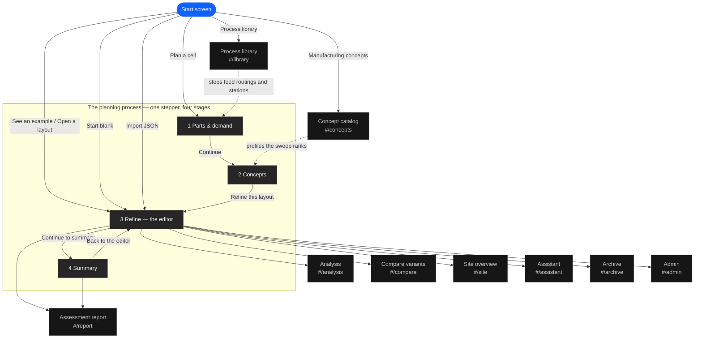
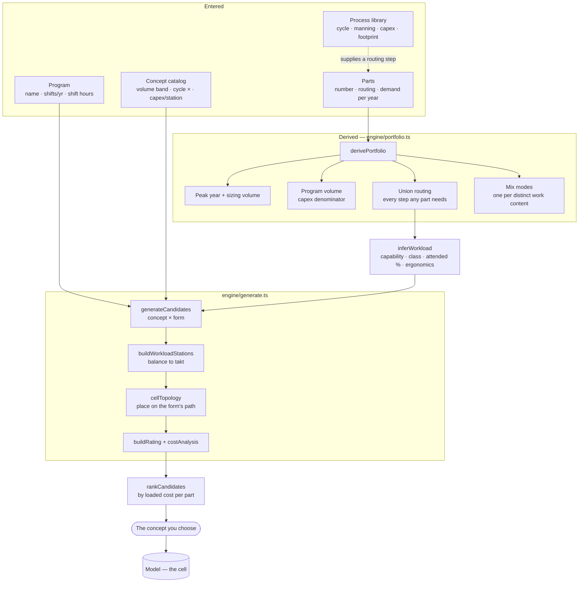
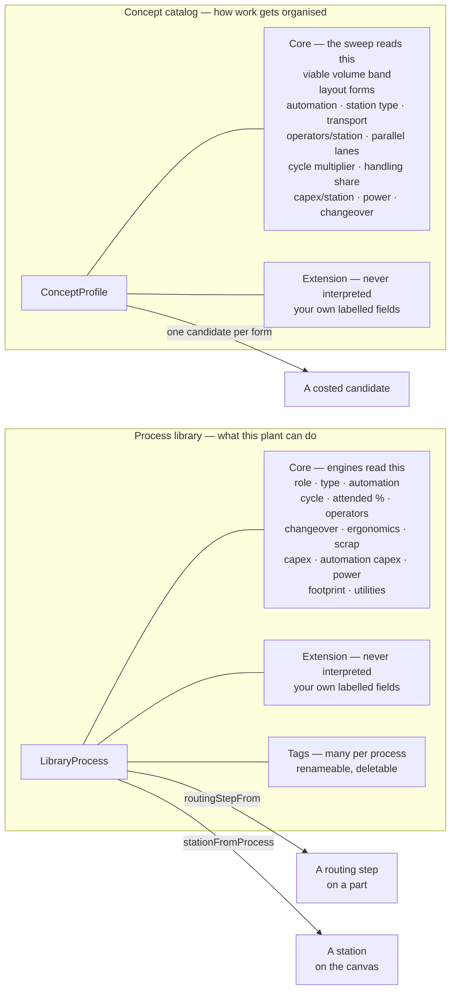
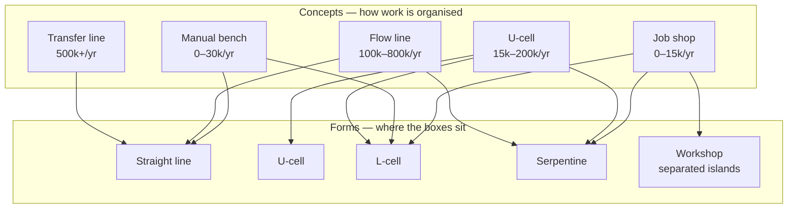
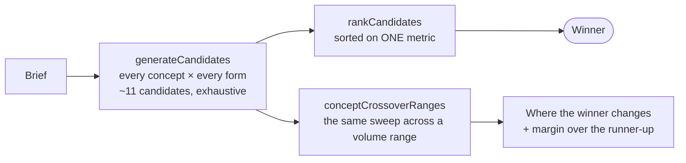
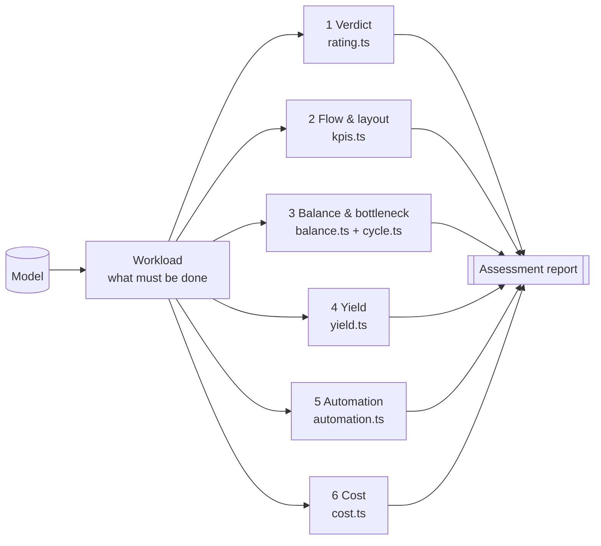
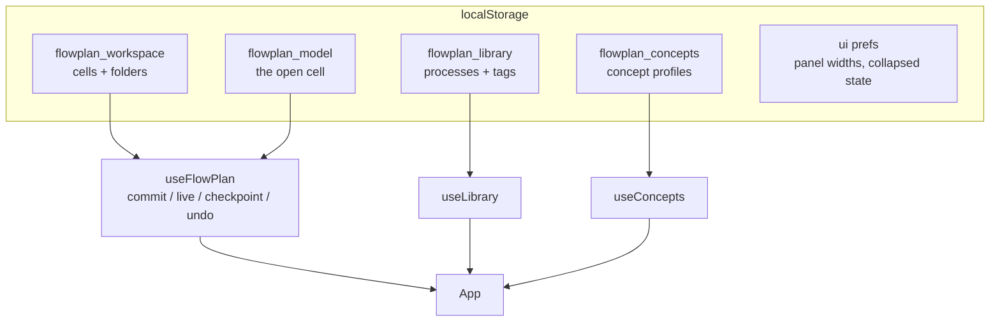

# How FlowPlan fits together

Every diagram here is generated from nothing — they are hand-maintained, so
treat them as documentation that can drift and check them against the code when
something looks wrong. `scripts/walkthrough.mjs` is the executable counterpart:
it walks the same flow and fails if a screen or control has moved.

---

## 1. Where you can be

Four destinations from the front door. The planning process is the only one
with stages; everything else is a page you open and leave.

The stepper is always present around the four stages, so earlier stages stay
reachable. The pages are hash routes; they replace the whole screen and come
back to the editor.

---

## 2. What the planner enters, and what the tool derives

The rule the whole app turns on: **the planner supplies the minimum, and every
derived value is labelled as derived.** Nothing below the dashed line is typed.

**Why the peak year and not an average:** a cell sized on an averaged annual
figure is too small for the busiest year and too big for the tail. Capex is
amortised over the whole program volume separately.

---

## 3. The two catalogs

Both are the planner's data, persisted separately from any cell, and both have
a fixed core the engines read plus a free-form half they never touch.

**The library starts empty.** A catalog arriving full of somebody else's
generic operations is one you clean out before you can trust it; the twelve
built-in operations are an import you choose.

**The concept catalog does not**, because with nothing in it the planner has
nothing to compare and the Concepts stage comes out blank — and these five are
industry archetypes rather than one plant's private knowledge. What matters is
that the numbers are visible and editable rather than a constant in a source
file. "Restore the shipped ones" is one button.

---

## 4. Concept × form

A **concept** is the organisational choice. A **form** is the geometry. They
are independent, and every concept is generated in each of the forms it allows,
so the number of candidates is the sum of each concept's form count.

The form decides the material path, and the material path is the *only* channel
by which the form affects cost — `flowCost` and `transportPerShift` are the
same number. Two consequences worth knowing:

- A straight line is the shortest material path, so it wins on transport by
  construction. That is correct physics for material.
- There is **no operator-walking model**. Distance costs money when material
  moves and never when a person does, so the U-cell's actual advantage — entry
  and exit adjacent, one operator closing the loop — earns nothing. Crediting it
  means costing walk time, which is not built.

---

## 5. What the "recommendation" actually is

Worth being precise, because it looks like more than it is.

**It is fully deterministic, and that is deliberate.** The candidate space is
about eleven options, so the sweep enumerates all of them rather than searching;
`buildRating` runs with `restarts: 0` to keep it reproducible. The same brief
always gives the same ranking. A search algorithm here would be slower,
non-reproducible, and could not find anything enumeration misses — so
"make the recommendation dynamic" should not mean making the *search* dynamic.

**What it is not:**

| | |
|---|---|
| Single objective | `rankCandidates` sorts on `loadedCostPerPart` and nothing else passes a different key. Capex exposure, flexibility, ramp-up risk and ergonomics are computed and displayed but do not enter the order. |
| `conceptFit` does not rank | The viable-volume band you can edit on the Concepts page drives the "Off-volume" tag and a line of rationale. It is **not** in the sort. Widening a band changes the labels, not the winner. |
| No learning | Nothing feeds back from built cells. That needs the monitoring app, which is not built. |

**What answers "how confident is this":** the crossover. One demand figure in
and one ranking out is the wrong shape for an RFQ, where demand is a forecast.
`conceptCrossoverRanges` re-runs the whole sweep across the volume axis, bisects
each boundary, and reports three things the ranked table cannot:

- where the winner changes, as a volume rather than a sample index;
- **how close the call is** — the margin over the best *other concept*. A band
  won by 0.8% is a coin toss between two sets of planning assumptions, and the
  single ranked list hides that entirely;
- where the catalog runs out — above some volume nothing makes the demand on one
  line, which is a finding rather than an empty result.

---

## 6. What the assessment reads

Six stages, in this order, on one page. The report is the same six written down.

---

## 7. Where state lives

`api.commit` is one undo entry; `api.live` is a drag in progress;
`api.checkpoint` opens an undo entry before a live sequence. The library and
the concept catalog are **not** undoable and **not** part of a cell — they
outlive any one layout, and resetting to the sample does not touch them.

---

## 8. What is not built

| | Status |
|---|---|
| Monitor serial production | Not built. Needs time-series storage and an MES/SCADA adapter. |
| Process feasibility matching | Not built. The library has no `producesFeatures`, `materials`, `toleranceMinMm` or `massRangeKg`, so nothing can answer "can this process make this feature in this material". |
| Operator-walk costing | Not built. See §4. |
| Batch / WIP costing | Not built. The Workshop form has the layout consequences of batch transfer; the WIP and lead time it buys are uncosted, so its real penalty is understated. |
| Per-team catalogs | Not built. Both catalogs are per-browser localStorage, not stored on `Team`. |
| Pattern library (spec §30–35) | Not built. |
| Multi-criteria ranking | Not built. The order is loaded cost per part alone — see §5. |
| Sensitivity / what-if | Only across volume, via the crossover. Labour rate, program length and mix uncertainty are not swept. |
