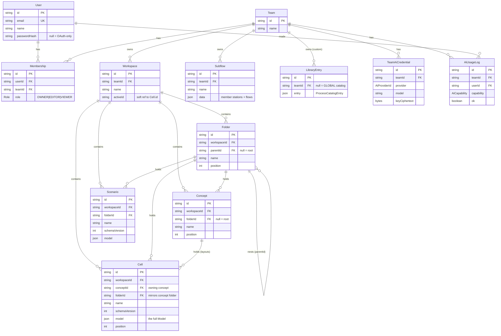

# FlowPlan — Entity-Relationship Diagram

The FlowPlan API (Express + Prisma + Postgres) is multi-tenant: a **User** joins
one or more **Teams** via a **Membership** (role OWNER/EDITOR/VIEWER); a Team owns
**Workspaces**, the shared **Subflows**, and its **custom Library entries**. Within
a Workspace the planning tree is **Folder › Concept › Layout(Cell)**, with
**Scenarios** as saved variants. Domain models (a Cell's/Scenario's `Model`, a
LibraryEntry's `ProcessCatalogEntry`, a Subflow's payload) are stored as JSON —
`@flowplan/core` owns their intra-JSON schema evolution, so a `SCHEMA_VERSION`
bump needs no Prisma migration.

The process **Library** is a global seed catalog (`LibraryEntry.teamId = null`)
plus per-team custom entries (`teamId` set). AI credentials/usage are team-scoped.

## Cascade & integrity rules
- Deleting a **Team** cascades to its Memberships, Workspaces (and everything
  inside), Subflows, custom LibraryEntries, and AI creds/usage.
- Deleting a **Workspace** cascades to its Folders, Concepts, Cells, Scenarios.
- Deleting a **Folder** reparents its child folders, concepts, cells and
  scenarios up one level (handled in the route; `SetNull` FK backstop).
- Deleting a **Concept** cascades to its Cells (a layout can't exist without a
  concept).
- **Global** LibraryEntries (`teamId = null`) are read-only over the API; only a
  team's own custom entries can be edited or deleted.
