# FlowPlan — visual walkthrough

A guided tour of the app after the **Carbon Design System compliance sweep**
(waves 1–9). Every screen below is built from real `@carbon/react` components —
no hand-rolled `<button>/<input>/<select>/<table>`, custom modals/menus/toasts,
or glyph icons remain on the interactive surface. Screenshots are captured from
a production build at 1440×900 (2× DPI).

> The Carbon callouts (▸) point out which components each screen now uses.

---

## 1 · Situation — the guided entry

The planner opens on a use-case picker, not a blank canvas.

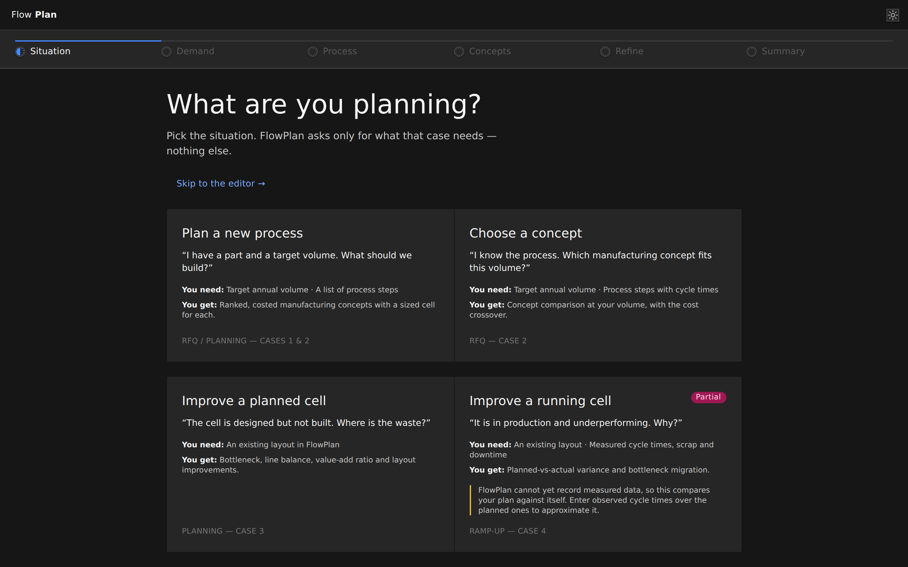

▸ Carbon `ProgressIndicator`/`ProgressStep` stepper · `ClickableTile` cards ·
`Tag` ("Partial") · `Button` (ghost) · header theme toggle · type from the
Carbon ramp throughout.

---

## 2 · Demand — data-model-faithful, multi-year

Volume can vary per program year, with a full shift model (shifts/day, working
days, OEE) and an optional variant mix.

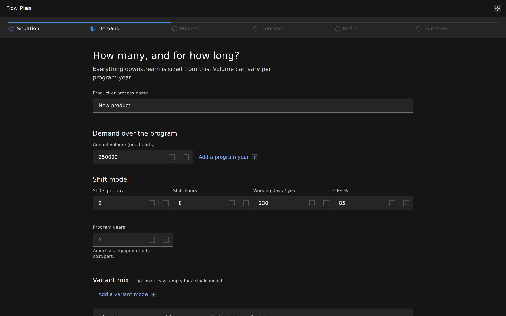

▸ Carbon `TextInput` · `NumberInput` (with steppers) · `Grid`/`Column` · derived
KPI `Tile`.

---

## 3 · Process — a per-step work-element table

The old paste-box is gone. Each step is an editable card exposing the real
`WorkElement` fields; every value shows the resolved (inferred-or-pinned) figure,
and editing pins it. Paste-from-Excel survives as an importer.

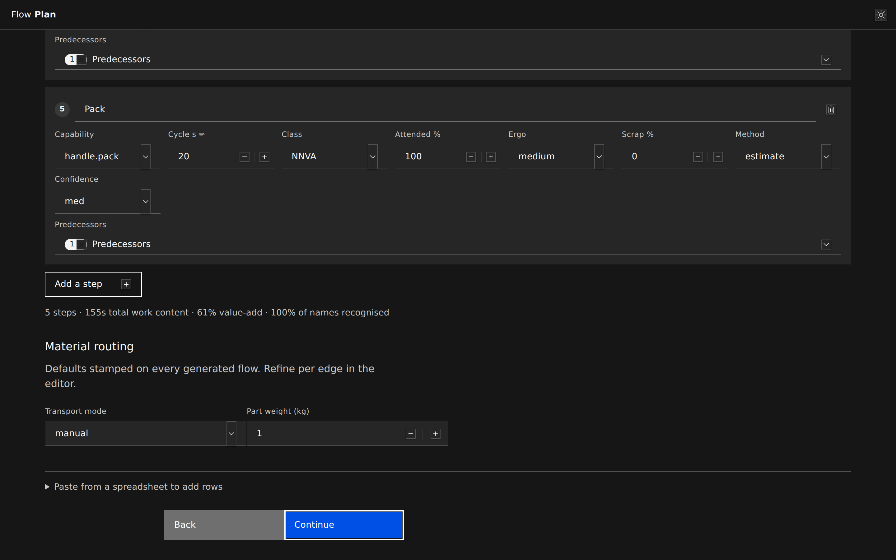

▸ Carbon `Tile` per step · `Select` (capability, class, ergo, method,
confidence) · `NumberInput` (cycle, attended %, scrap %) · `MultiSelect`
(predecessors → a DAG) · `Button` ("Add a step") · a material-routing `Select` +
`NumberInput` · the paste importer in a native `
`.

---

## 4 · Concepts — ranked, costed comparison

The engine sweeps concept × form and ranks every candidate by fully-loaded cost.

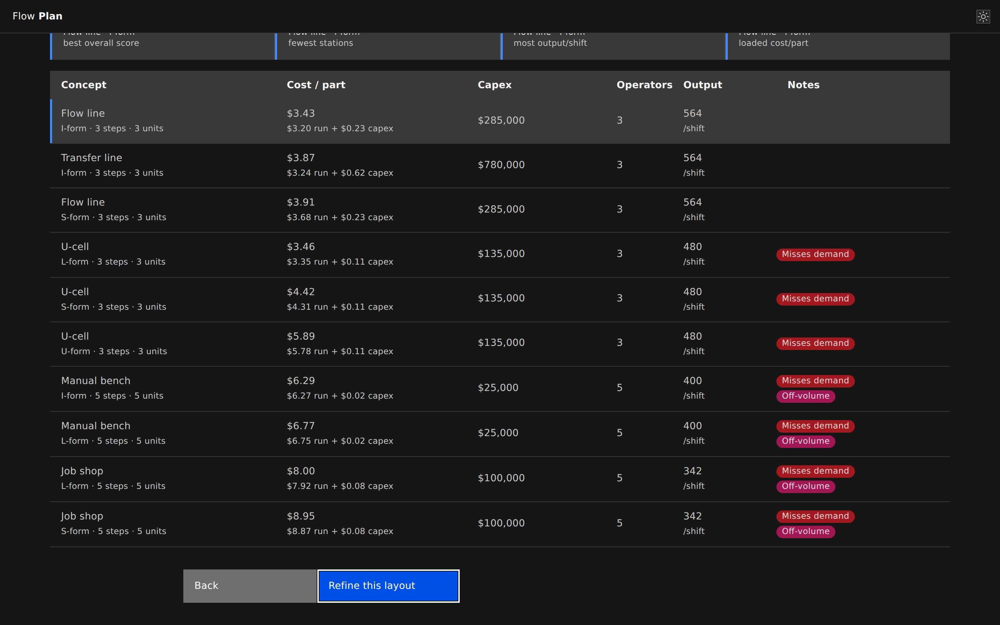

▸ Carbon `ClickableTile` featured cards · `StructuredList` comparison · `Tag`
verdicts.

---

## 5 · Editor — node-RED layout, Carbon chrome

Left library rail · full-bleed canvas · right inputs rail. The view switcher and
overlay toggles are Carbon Buttons with `@carbon/icons-react` icons.

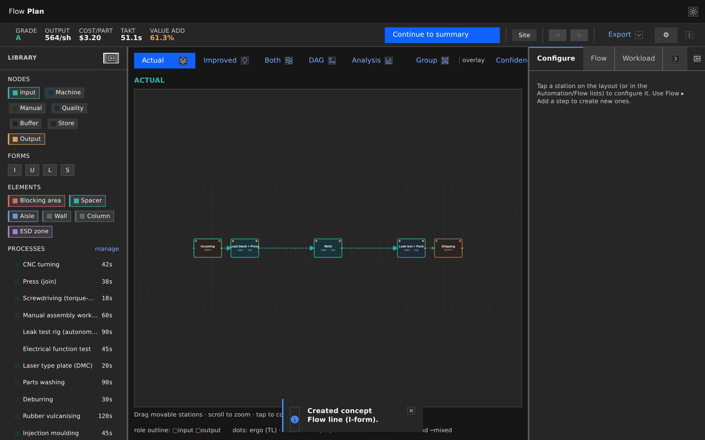

▸ View switcher (`Actual/Improved/Both/DAG/Analysis`) → Carbon `Button` +
icons, selected state via `kind` · header KPIs on the type ramp · `Tabs` on the
inputs rail.

---

## 6 · Inspector rail — the Carbon form set

Selecting a step opens Configure. This is the most-used editing surface and was
almost entirely raw controls before the sweep.

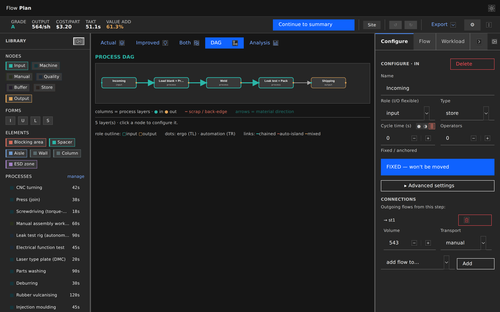

▸ Carbon `NumberInput` (cycle, operators) · `Select` (role, type, transport) ·
`Button` (Delete = `danger--tertiary`, FIXED = `primary`, Add) · the
data-quality provenance selector · `Tabs` (Configure/Flow/Workload) · collapse
`IconButton`.

---

## 7 · Analysis — a Carbon dashboard

Every derived figure lives here: KPI tiles, the Yamazumi, the precedence graph,
and actionable open points.

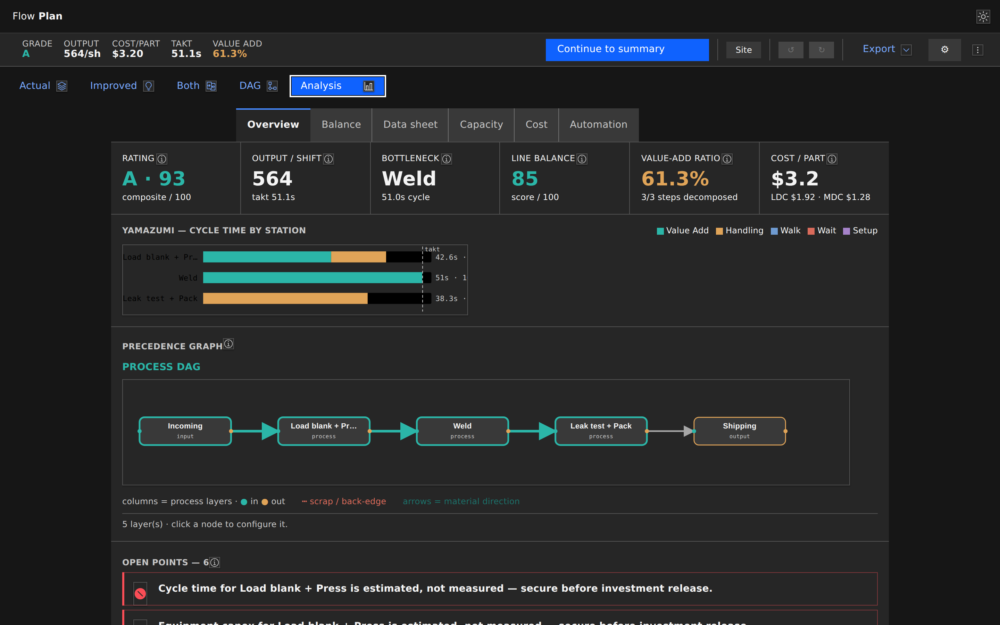

▸ Carbon `Tabs` (Overview/Balance/Data sheet/Capacity/Cost/Automation) · `Tile`
KPIs with `Toggletip` info buttons · open points as `InlineNotification`.

---

## 8 · Balance — line ratio & waste backlog

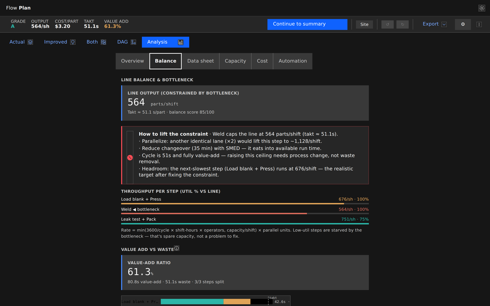

▸ Carbon `Tabs` · `StructuredList` · `Tile` · `InlineNotification`.

---

## 9 · Workspace — the new Carbon `TreeView`

The workspace tree (Folder › Concept › Layout) is now a Carbon `TreeView` /
`TreeNode`: Carbon owns the twisty, indentation and keyboard navigation, while
the custom drag-and-drop reparenting, inline rename, per-row overflow menu and
archive controls all live inside the node label.

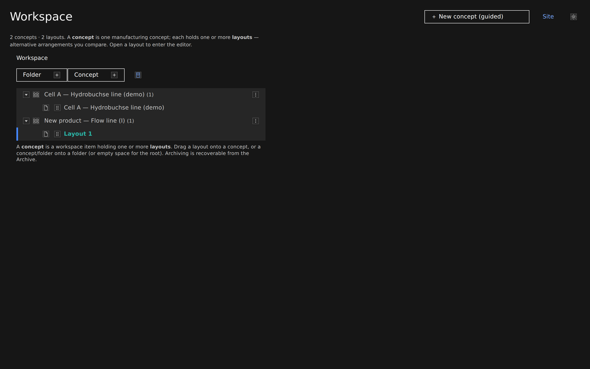

▸ Carbon `TreeView`/`TreeNode` (nested treeitems, active-layout selection bar) ·
row `OverflowMenu` · `Button` action bar (Folder/Concept/Archive) with icons.

---

## 10 · Library — global catalog + team customs

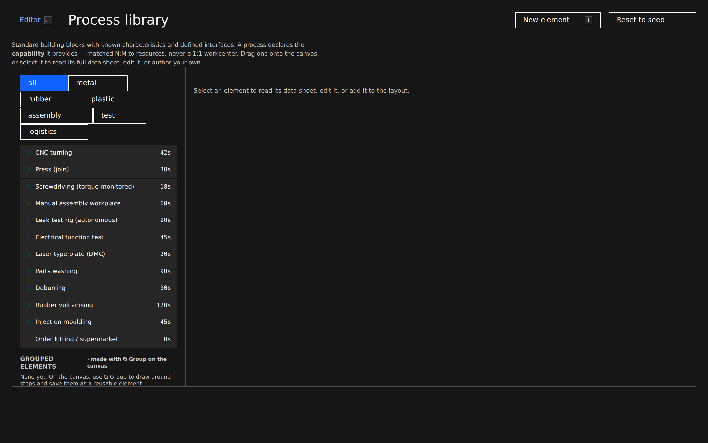

▸ Carbon `Tabs` (Edit/Documentation) · `Button` · `StructuredList` · `Tag`.

---

## 11 · Light theme — the same surface, re-themed

The theme toggle flips the whole app between Carbon `g100` (dark) and `white`
(light) — the TreeView, tooltips and buttons all re-theme from `--cds-*` tokens.

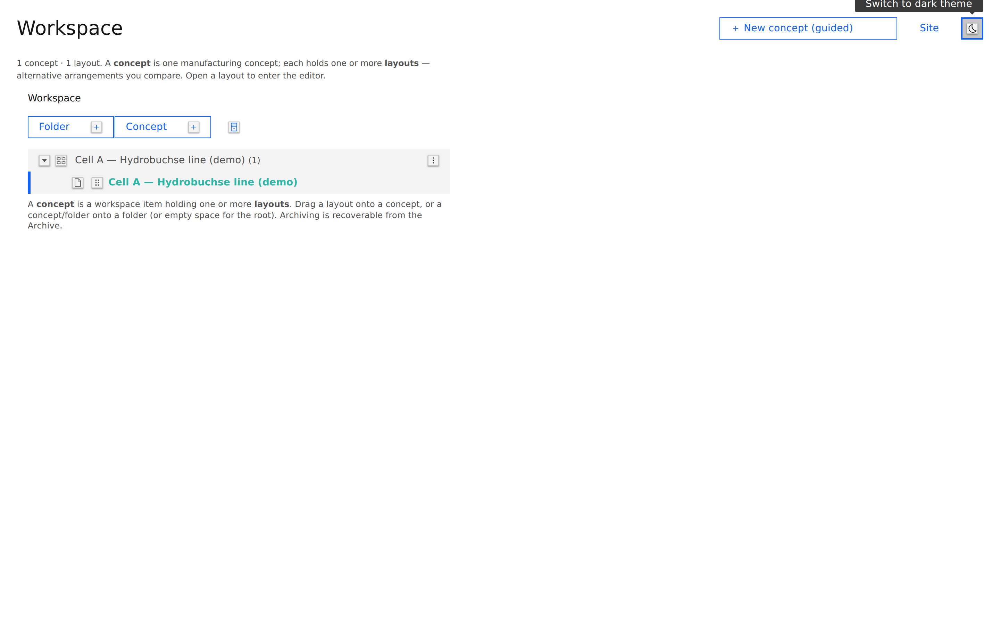

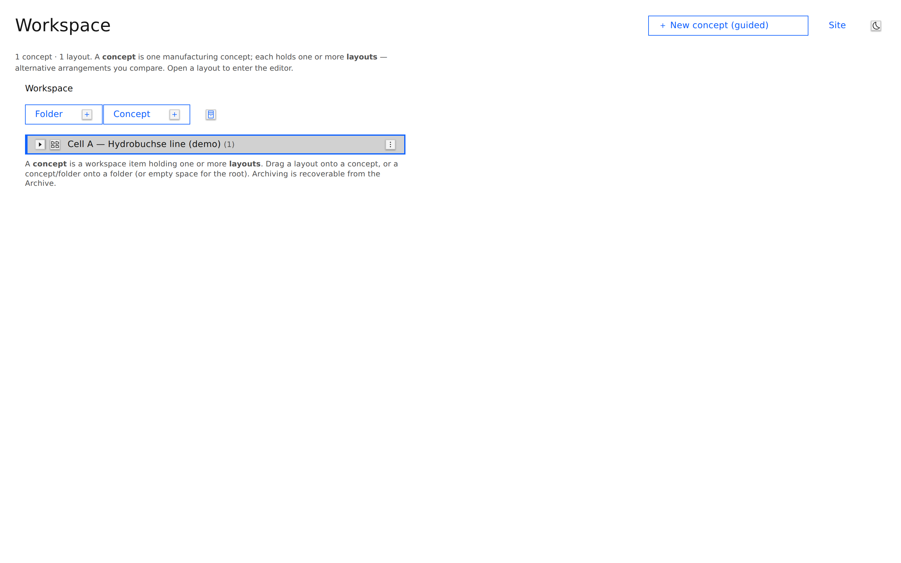

▸ Carbon `<Theme>` wrapper on every route · `Toggletip` tooltip on the toggle ·
station-type fills carry a light ramp so the canvas stays legible.

---

_See [`carbon-gap-analysis.md`](carbon-gap-analysis.md) for the full audit and
the per-wave breakdown of what became Carbon._
